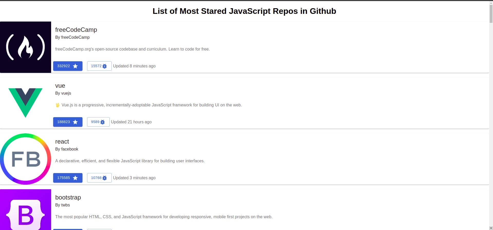

# Github Stargazers Web App

## This is a small webapp that will list the 50 most stared Javascript Github repos.  
<br>

### This app has created by using  [React](https://reactjs.org/) for developing Client side . And also the API Data Come from Github  [Graph QL](https://graphql.org/)  API site where we can fetch all Github data.
<br>

### To fetch the data from Graph-Ql ApI to client, This App used React [Apollo client](https://www.apollographql.com/docs/react/) which is a comprehensive state management library for JavaScript that enables us to manage both local and remote data with GraphQL. Use it to fetch, cache, and modify application data, all while automatically updating your UI.
<br>

## To Run This App
### 1. Clone the repo by using this [link](https://github.com/SinthujanSintha/github-stargazers.git).
### 2. Once cloned the repo type in the terminal  ```yarn install```  to install all dependcies.
### 3. Then type ``` yarn start``` to start the app.
### Some sample snaps of this app.
<br>

## HomePage


<br>
## ListRepoPage


 
 
 
 

